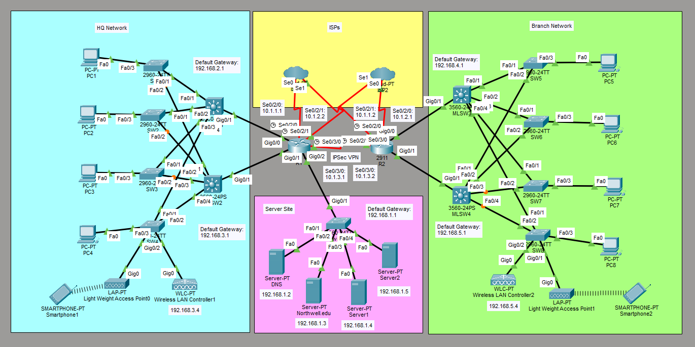

# Hospital Network Simulation
This is a lab to configure a hospital network in Cisco Packet Tracer. This simulation would be configured like how a hospital network would be configured in a hospital setting.



## IP Address of the Routers
R1: 
- Interface: Se0/2/0
	- IPv4 Address: 10.1.1.1
	- Subnet Mask: 255.255.255.0
- Interface: Se0/2/1
	- IPv4 Address: 10.1.2.2
	- Subnet Mask: 255.255.255.0
- Interface: Se0/3/0
	- IPv4 Address: 10.1.3.1
	- Subnet Mask: 255.255.255.0

R2: 
- Interface: Se0/2/0
	- IPv4 Address: 10.1.2.1
	- Subnet Mask: 255.255.255.0
- Interface: Se0/2/1
	- IPv4 Address: 10.1.1.2
	- Subnet Mask: 255.255.255.0
- Interface: Se0/3/0
	- IPv4 Address: 10.1.3.2
	- Subnet Mask: 255.255.255.0

## IP Address of the Servers
DNS:
- IPv4 Address: 192.168.1.2
- Subnet Mask: 255.255.255.0
- Default Gateway: 192.168.1.1
- DNS Server: 192.168.1.2

Northwell.edu
- IPv4 Address: 192.168.1.3
- Subnet Mask: 255.255.255.0
- Default Gateway: 192.168.1.1

Server1
- IPv4 Address: 192.168.1.4
- Subnet Mask: 255.255.255.0
- Default Gateway: 192.168.1.1

Server2
- IPv4 Address: 192.168.1.5
- Subnet Mask: 255.255.255.0
- Default Gateway: 192.168.1.1

## Configure IP Address of the Routers
Configure the IP address of the interfaces of the routers.

Interface Se0/2/0 on R1:
```
R1# conf t
R1(config)# int Se0/2/0
R1(config-if)# ip add 10.1.1.1 255.255.255.0
R1(config-if)# no shut
R1(config-if)# exit
```

Interface Se0/2/1 on R1:
```
R1# conf t
R1(config)# int Se0/2/1
R1(config-if)# ip add 10.1.2.2 255.255.255.0
R1(config-if)# no shut
R1(config-if)# exit
```

Interface Se0/3/0 on R1:
```
R1# conf t
R1(config)# int Se0/3/0
R1(config-if)# ip add 10.1.3.1 255.255.255.0
R1(config-if)# no shut
R1(config-if)# end
```

Interface Se0/2/0 on R2:
```
R2# conf t
R2(config)# int Se0/2/0
R2(config-if)# ip add 10.1.2.1 255.255.255.0
R2(config-if)# no shut
R2(config-if)# exit
```

Interface Se0/2/1 on R2:
```
R2# conf t
R2(config)# int Se0/2/1
R2(config-if)# ip add 10.1.1.2 255.255.255.0
R2(config-if)# no shut
R2(config-if)# exit
```

Interface Se0/3/0 on R2:
```
R2# conf t
R2(config)# int Se0/3/0
R2(config-if)# ip add 10.1.3.2 255.255.255.0
R2(config-if)# no shut
R2(config-if)# end
```

## Configure IP Address of the Servers
On the server called DNS, go to Desktop -> IP Configuration. Set the IPv4 address, Subnet Mask, Default Gateway, and DNS Server according to the *IP Address of the Servers*.

On the rest of the servers, go to Desktop -> IP Configuration. Set the IPv4 address, Subnet Mask, and Default Gateway according to the *IP Address of the Servers*.

## Configure DHCP
Configure DHCP with a DHCP pool called DHCPPool0 on R1:
```
R1# conf t
R1(config)# ip dhcp excluded-address 192.168.2.1 192.168.2.10
R1(config)# ip dhcp pool DHCPPool0
R1(dhcp-config)# default-router 192.168.2.1
R1(dhcp-config)# dns-server 192.168.1.2
R1(dhcp-config)# network 192.168.2.0 255.255.255.0
R1(dhcp-config)# end
```

Configure DHCP with a DHCP pool called DHCPPool1 on R1:
```
R1# conf t
R1(config)# ip dhcp excluded-address 192.168.3.1 192.168.3.10
R1(config)# ip dhcp pool DHCPPool1
R1(dhcp-config)# default-router 192.168.3.1
R1(dhcp-config)# dns-server 192.168.1.2
R1(dhcp-config)# network 192.168.3.0 255.255.255.0
R1(dhcp-config)# end
```

Configure DHCP with a DHCP pool called DHCPPool0 on R2:
```
R2# conf t
R2(config)# ip dhcp excluded-address 192.168.4.1 192.168.4.10
R2(config)# ip dhcp pool DHCPPool0
R2(dhcp-config)# default-router 192.168.4.1
R2(dhcp-config)# dns-server 192.168.1.2
R2(dhcp-config)# network 192.168.4.0 255.255.255.0
R2(dhcp-config)# end
```

Configure DHCP with a DHCP pool called DHCPPool1 on R2:
```
R2# conf t
R2(config)# ip dhcp excluded-address 192.168.5.1 192.168.5.10
R2(config)# ip dhcp pool DHCPPool1
R2(dhcp-config)# default-router 192.168.5.1
R2(dhcp-config)# dns-server 192.168.1.2
R2(dhcp-config)# network 192.168.5.0 255.255.255.0
R2(dhcp-config)# end
```

## Configure Wireless LAN
Create the WLAN for Wireless LAN Contoller1. Go to Config -> Wireless LANs. Add a WLAN with the following information:
- SSID: Lunalight
- Authentication: WPA2-PSK
- PSK Pass Phrase: darkmoon

Create the WLAN for Wireless LAN Contoller2. Go to Config -> Wireless LANs. Add a WLAN with the following information:
- SSID: Bigvolcano
- Authentication: WPA2-PSK
- PSK: brightlava

## Configure DHCP on the PCs
Configure DHCP on the PCs.

On each PC, go to Desktop and IP Configuration. Set the IP Configuration to DHCP and wait for the IP address to populate.

## Setup Wi-Fi on the Smart Phones
Setup Wi-Fi on the smart phones.

On Smartphone1, go to Config -> Wireless0. Set the information for Wireless0:
- SSID: Lunalight
- Authentication: WPA2-PSK
- PSK Pass Phrase: darkmoon

Make sure the IP Configuration is set to DHCP and wait for the IP address to populate.

On Smartphone1, go to Config -> Wireless0. Set the information for Wireless0:
- SSID: Bigvolcano
- Authentication: WPA2-PSK
- PSK Pass Phrase: brightlava

Make sure the IP Configuration is set to DHCP and wait for the IP address to populate.

## Configure OSPF
Configure OSPF on R1:
```
R1# conf t
R1(config)# router ospf 1
R1(config-router)# network 10.1.1.0 0.0.0.255 area 0
R1(config-router)# network 10.1.2.0 0.0.0.255 area 0
R1(config-router)# network 192.168.1.0 0.0.0.255 area 0
R1(config-router)# network 192.168.2.0 0.0.0.255 area 0
R1(config-router)# network 192.168.3.0 0.0.0.255 area 0
R1(config-router)# end
```

Configure OSPF on R2:
```
R2# conf t
R2(config)# router ospf 1
R2(config-router)# network 10.1.1.0 0.0.0.255 area 0
R2(config-router)# network 10.1.2.0 0.0.0.255 area 0
R2(config-router)# network 192.168.4.0 0.0.0.255 area 0
R2(config-router)# network 192.168.5.0 0.0.0.255 area 0
R2(config-router)# end
```

## Configure DNS and Web Servers
On the server called DNS, go to Services -> DNS. Turn on the DNS service. Add a DNS record with the following information:
- Name: www.northwell.edu
- Type: A Record
- Address: 192.168.1.3

Save the DNS record.

On the server called Northwell.edu, go to Services -> HTTP. Make sure the HTTP service is on. Edit the index.html website like this:
```
<html>
<body>
<h1>Northwell Health</h1>
<p>Welcome to Northwell Health.</p>
</body>
</html>
```

Test the website on the PCs.

On PC1, go to Desktop -> Web Browser.
Type in the url, www.northwell.edu, and check if the page appears on the browser.

On PC5, go to Desktop -> Web Browser.
Type in the url, www.northwell.edu, and check if the page appears on the browser.

## Configure IPSec VPN
Configure and verify the IPSec VPN. You will configure and verify a site-to-site VPN.

**Configure the IPSec VPN**

Enable the Security Technology package on R1:
```
R1# conf t
R1(config)# license boot module c2900 technology-package securityk9
```

Save the running config to the startup config:
```
R1# copy run start
```

Reload R1:
```
R1# reload
```

Configure ACL 100 to identify interesting traffic on R1:
```
R1(config)# access-list 110 permit ip 192.168.2.0 0.0.0.255 192.168.4.0 0.0.0.255
R1(config)# access-list 110 permit ip 192.168.2.0 0.0.0.255 192.168.5.0 0.0.0.255
R1(config)# access-list 110 permit ip 192.168.3.0 0.0.0.255 192.168.4.0 0.0.0.255
R1(config)# access-list 110 permit ip 192.168.3.0 0.0.0.255 192.168.5.0 0.0.0.255
```

Configure the IKE phase 1 ISAKMP policy on R1:
```
R1(config)# crypto isakmp policy 10
R1(config-isakmp)# encryption aes 256
R1(config-isakmp)# authentication pre-share
R1(config-isakmp)# group 5
R1(config-isakmp)# exit
R1(config)# crypto isakmp key vpnpa55 address 10.1.3.2
```

Configure the IKE phase 2 IPsec policy on R1:
```
R1(config)# crypto ipsec transform-set VPN-SET esp-aes esp-sha-hmac
```

Configure the IKE phase 1 ISAKMP properties on R1:
```
R1(config)# crypto map VPN-MAP 10 ipsec-isakmp
R1(config-crypto-map)# description VPN connection to R2
R1(config-crypto-map)# set peer 10.1.3.2
R1(config-crypto-map)# set transform-set VPN-SET
R1(config-crypto-map)# match address 110
R1(config-crypto-map)# exit
```

Configure the VPN-MAP crypto map on the outgoing Serial 0/3/0 interface:
```
R1(config)# int Se0/3/0
R1(config-if)# crypto map VPN-MAP
R1(config-if)# end
```

Enable the Security Technology package on R2:
```
R2# conf t
R2(config)# license boot module c2900 technology-package securityk9
```

Save the running config to the startup config:
```
R2# copy run start
```

Reload R2:
```
R2# reload
```

Configure ACL 100 to identify interesting traffic on R2:
```
R2(config)# access-list 110 permit ip 192.168.4.0 0.0.0.255 192.168.2.0 0.0.0.255
R2(config)# access-list 110 permit ip 192.168.4.0 0.0.0.255 192.168.3.0 0.0.0.255
R2(config)# access-list 110 permit ip 192.168.5.0 0.0.0.255 192.168.2.0 0.0.0.255
R2(config)# access-list 110 permit ip 192.168.5.0 0.0.0.255 192.168.3.0 0.0.0.255
```

Configure the IKE phase 1 ISAKMP policy on R2:
```
R2(config)# crypto isakmp policy 10
R2(config-isakmp)# encryption aes 256
R2(config-isakmp)# authentication pre-share
R2(config-isakmp)# group 5
R2(config-isakmp)# exit
R2(config)# crypto isakmp key vpnpa55 address 10.1.3.1
```

Configure the IKE phase 2 IPsec policy on R2:
```
R2(config)# crypto ipsec transform-set VPN-SET esp-aes esp-sha-hmac
```

Configure the IKE phase 1 ISAKMP properties on R2:
```
R2(config)# crypto map VPN-MAP 10 ipsec-isakmp
R2(config-crypto-map)# description VPN connection to R1
R2(config-crypto-map)# set peer 10.1.3.1
R2(config-crypto-map)# set transform-set VPN-SET
R2(config-crypto-map)# match address 110
R2(config-crypto-map)# exit
```

Configure the VPN-MAP crypto map on the outgoing Serial 0/3/0 interface:
```
R2(config)# int Se0/3/0
R2(config-if)# crypto map VPN-MAP
R1(config)# end
```

**Verify the IPSec VPN**

Verify the tunnel prior to interesting traffic on R1:
```
R1# show crypto ipsec sa
```

On PC1, go to Desktop -> Command Prompt.

Ping PC5:
```
C:\> ping 192.168.4.15
```

 Verify the tunnel after interesting traffic on R1:
```
R1# show crypto ipsec sa
```

If the number of packets is more than 0, this means that the IPsec VPN tunnel is working.

Verify the tunnel prior to interesting traffic on R2:
```
R2# show crypto ipsec sa
```

On PC5, go to Desktop -> Command Prompt.

Ping PC1:
```
C:\> ping 192.168.3.14
```

 Verify the tunnel after interesting traffic on R1:
 ```
 R2# show crypto ipsec sa
 ```

If the number of packets is more than 0, this means that the IPsec VPN tunnel is working.

## Save Router Configurations
Go to each router and save the running configuration to the startup configuration.

Save the config for R1:
```
R1# copy run start
```

Save the config for R2:
```
R2# copy run start
```